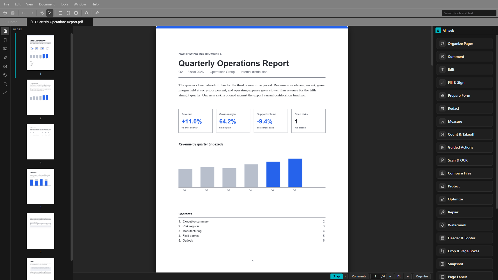
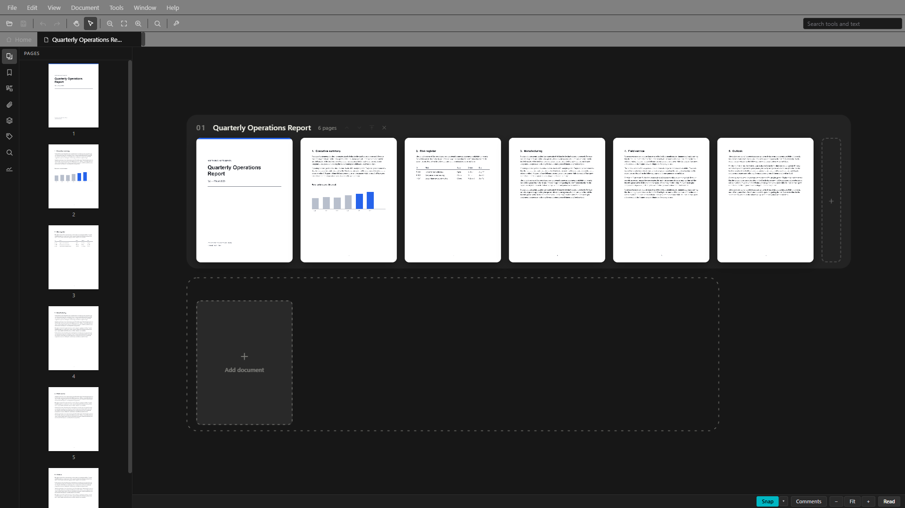
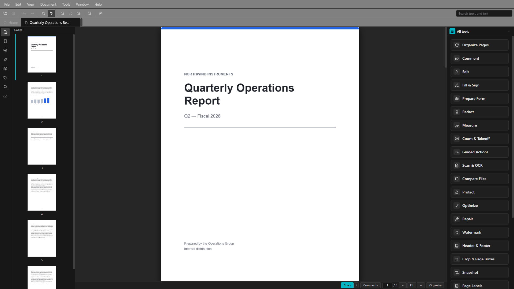

# Spectra PDF

[](https://github.com/jasonulbright/Spectra-PDF/actions/workflows/ci.yml)
[](https://github.com/jasonulbright/Spectra-PDF/releases/latest)
[](https://github.com/jasonulbright/Spectra-PDF/releases)
[](LICENSE)
[](https://github.com/jasonulbright/Spectra-PDF/releases/latest)

A modern, open-source PDF workbench for Windows. Tauri v2 + React, with an embedded Python engine and vendored upstream Ghostscript (AGPL-3.0). No ads, no telemetry, no upsells. WebView2 prerequisite (ships with Windows 10/11).



## What it is

A full-featured PDF workbench with a familiar user interface: a menu bar, customizable toolbar, and document tabs over a continuous reading view; a navigation pane on the left; twenty-four task-oriented tools that open in a resizable pane on the right — your document never leaves the screen; and a status bar carrying page, zoom, and any pending work. The keymap is verified against the industry-standard editor's published shortcut table, so your muscle memory just works. Every whole-file operation also ships as a CLI subcommand with identical results.

### Reading & navigating
- **Reading view** — continuous, virtualized scroll; smooth with 1,000-page documents. Real text selection and copy (select text to highlight, underline, strike out, or link it), zoom presets (`Ctrl+0/1/2`), go-to-page (`Ctrl+Shift+N`), Rotate View (`Ctrl+Shift+Plus/Minus` — the page turns, the file doesn't), Hand/Select with Space as a temporary hand, two-page spreads with a cover option, Reading Mode (`Ctrl+H`), and full-screen Presentation (`F5`)
- **A workbench that never hides your document** — tools open in a resizable side pane beside the page (toggle it from the toolbar or `Shift+F4`; it narrows to an index of tool names and widens for the tool you pick), a status bar carries page/zoom/view controls and any pending work, every open file is a tab, and the toolbar is customizable (per-button show/hide). A context-sensitive Properties Bar (`Ctrl+E`) shows the selected annotation's details
- **Organize view** — every open file as a strip of live page thumbnails; drag pages within and across documents, multi-select, whole-document merge, drop files to import their pages at that spot. All of it staged in memory, committed atomically, undoable
- **Navigation pane** (`F4`) — Pages (thumbnails with drag-reorder), Bookmarks (with editing), Search, Signatures
- **Find & Search** — a universal search box in the toolbar that answers with both **tools and document text** in one list (type a tool's name to launch it, or a phrase to jump to the page), plus floating find (`Ctrl+F`, `F3`/`Ctrl+G` stepping) and a workspace-wide Search panel (`Ctrl+Shift+F`) with regex, case and whole-word modes and an on-disk scope. Scanned pages become searchable (and selectable) via OCR
- **Batch OCR** (Tools ▸ Batch OCR Folder…) — point it at a folder and get a mirrored copy of the whole tree with every scanned PDF made searchable; already-searchable files copy through unchanged and problem files are reported. Your originals stay untouched unless you pick the explicit replace-in-place mode, which stages each result beside the original, verifies it reads back, and only then swaps it over. Fully offline, like all OCR here



### The twenty-four tools
- **Organize Pages** — reorder, rotate, delete, split, extract — and merge pages between open files by dragging
- **Comment** — highlights, text boxes, ink, and stamps, with notes and recoloring on each; existing PDF annotations import as editable; one list of every comment in the document — jump to it, edit its note, recolour or delete it, or clear them all
- **Edit** — select an image, a paragraph, or a line of text on the page: move, resize, rotate, crop, dim, replace, extract or delete images and place new ones; rewrite text in place in the document's own font with live validation, kerned like a typesetter; edit whole paragraphs with true rewrap, split and merge, restyle size, colour, family, bold and italic — plus real OpenType small caps and stylistic alternates — for a whole paragraph or a selected range; move, resize, recolour, re-width or delete drawn vector shapes, even inside groups; add brand-new text boxes. Right-to-left scripts — Arabic, Hebrew, Persian, Urdu — reflow and author like any other, with cursive letters joined correctly; Chinese, Japanese and Korean too
- **Fill & Sign** — AcroForm fill on the page; digital signatures: verify with your own trust anchors, sign with PFX/PEM including PAdES baseline-through-LTA profiles with timestamping, visible stamps, sign-into-field, counter-signing
- **Prepare Form** — draw new fields on the page; view and edit the document's JavaScript
- **Redact** — true content removal
- **Measure** — distance, perimeter, and area on the page, with a real-world scale ratio ("1 in = 2 ft"); finished measurements stay on the page as markups you can delete like any comment
- **Guided Actions** — save sequences of steps (compress, watermark, page numbers, OCR, strip metadata, encrypt to a new file…) and run them on a document with one click; any setting can be asked for at run time — passwords always are, and are never stored
- **Scan & OCR** — make scanned pages searchable, in 47 languages, fully offline
- **Compare** — text and visual diff
- **Protect** — AES-256 encrypt/decrypt with owner-permission controls
- **Optimize** — compress, grayscale, convert to CMYK, linearize, PDF/A, PDF version
- **Repair** — three tiers, up to per-page salvage
- **Watermark**
- **Header & Footer** — six positions, page-number and auto-incrementing Bates tokens
- **Crop & Page Boxes** — crop/bleed/trim/art
- **Page Labels** — front matter as i, ii, iii; prefixed appendices, and the page box navigates by them
- **Attachments** — embed, extract, remove
- **Portfolio** — open a portfolio and work its files; create one from any files on disk, or convert the open document; add, open, save out, update, and remove member files
- **Layers** — show/hide optional content
- **Accessibility** — checker, structure-tag editor, reading-order panel
- **Preflight** — fonts, colour, and transparency checks for print
- **Links** — list, retarget, or remove link regions — and create them from selected text
- **Export** — text extraction, Word/RTF/ODT/HTML via a bundled converter, page images as PNG/JPEG/TIFF



### Documents & files
- **Print** (`Ctrl+P`) — printer picker, page range, copies, fit/actual, through the bundled Ghostscript to any Windows printer
- **Create PDF from PostScript** — convert `.ps`/`.eps` to PDF with quality presets (Smallest / eBook / Print / Press), the classic distilling job, done by the bundled Ghostscript
- **Document Properties** (`Ctrl+D`), categorized **Preferences** (`Ctrl+K`)
- Insert pages from a file (`Ctrl+Shift+I`) or blank (`Ctrl+Shift+T`), delete (`Ctrl+Shift+D`), rotate (`Ctrl+Shift+R`), split, extract
- `.pdfx` support — [Alexandros Gounis's open format](https://github.com/AlexandrosGounis/pdfx): several documents saved as one ordinary, fully-compatible PDF that reopens as separate strips
- Multi-level undo/redo across staged page edits and applied operations; one file is one document no matter how its path is spelled

### Desktop citizenship
NSIS installer with silent modes and enterprise policy, file associations, Explorer context menu, system tray, start-with-Windows, update notifications (the app never downloads or installs updates itself), light/dark/high-contrast/system themes carrying the Windows accent + Mica, WCAG 2.1 AA (an axe-core audit of every surface in all three themes runs in the test battery, alongside a keyboard-operability suite and a theme-consistency audit), full keyboard navigation (single-key tool accelerators available, off by default).

## Command Line

When invoked with a subcommand, Spectra PDF runs headless — no window, same engine. `spectrapdf.exe /?` shows the full list.

```bash
# Compress
spectrapdf compress input.pdf -o compressed.pdf --quality ebook

# Merge / split / rotate / delete
spectrapdf merge a.pdf b.pdf c.pdf -o merged.pdf
spectrapdf split input.pdf -o output_dir/ --ranges "1-3,5-7"
spectrapdf split manual.pdf -o chapters/ --mode bookmarks   # also: --mode every-n --every-n 10
spectrapdf split big.pdf -o parts/ --mode size --max-mb 5
spectrapdf rotate input.pdf -o rotated.pdf --angle 90 --pages 1,3,5
spectrapdf delete input.pdf -o trimmed.pdf --pages 3,7

# Print — to any installed Windows printer, via the bundled Ghostscript
spectrapdf printers                       # list printers (JSON, with the default)
spectrapdf printers --capabilities "Brother HL-L2400D"   # papers/duplex/colour as JSON
spectrapdf print input.pdf --printer "Brother HL-L2400D" --pages 1-3 --copies 2 --fit fit
# full option surface: --subset odd|even --reverse --no-collate --duplex long|short|simplex
#   --paper <id> --orientation portrait|landscape --color gray --comments document|stamps
#   --as-image --image-dpi 300 --layout nup|booklet|poster (each with its own flags; see --help)
spectrapdf print big-drawing.pdf --printer "Brother HL-L2400D" --layout poster --poster-scale 200 --poster-cut-marks

# Apply an edited copy's annotate/fill/add-page changes onto a SIGNED original
# as one incremental append — its signatures keep verifying
spectrapdf incremental-save signed.pdf edited-copy.pdf -o signed-updated.pdf

# Create PDF from PostScript/EPS (distill)
spectrapdf distill input.ps -o output.pdf --preset printer

# Encrypt / decrypt
spectrapdf encrypt input.pdf -o encrypted.pdf --password secret
spectrapdf decrypt encrypted.pdf -o decrypted.pdf --password secret

# PDF/A, optimize, grayscale, version
spectrapdf pdfa input.pdf -o archive.pdf --level 2b
spectrapdf audit-space input.pdf          # where the bytes went, by category (JSON)
spectrapdf optimize input.pdf -o optimized.pdf --linearize --strip-metadata --compress-streams
spectrapdf grayscale input.pdf -o grayscale.pdf
spectrapdf pdf-version input.pdf -o out.pdf --version 1.7

# Text, metadata
spectrapdf extract-text input.pdf --pages 1,2,3
spectrapdf metadata input.pdf --title "New Title" -o updated.pdf
spectrapdf metadata input.pdf --strip -o stripped.pdf

# Forms — list fields (JSON), or fill (± flatten)
spectrapdf forms input.pdf
spectrapdf forms input.pdf -o filled.pdf --set name=Ada --set subscribe=true --flatten

# Bookmarks — read (JSON) or replace
spectrapdf outline input.pdf
spectrapdf outline input.pdf -o out.pdf --from-json bookmarks.json

# Signatures
spectrapdf verify-signatures signed.pdf
spectrapdf sign input.pdf -o signed.pdf --pfx signer.pfx --password pass
spectrapdf sign input.pdf -o signed.pdf --pfx signer.pfx --password pass --pades b-lta --tsa-url http://timestamp.example/tsa
spectrapdf verify-signatures signed.pdf --trust-root my-ca.pem
spectrapdf generate-signer -o me.pfx --cn "My Name" --password pass

# Compare, redact, watermark, repair tiers
spectrapdf compare a.pdf b.pdf
spectrapdf redact input.pdf -o redacted.pdf --page 1 --rect 100,100,300,150
spectrapdf watermark input.pdf -o marked.pdf --text "CONFIDENTIAL"
spectrapdf repair broken.pdf -o repaired.pdf
spectrapdf rebuild broken.pdf -o rebuilt.pdf
spectrapdf recover broken.pdf -o recovered.pdf
spectrapdf check input.pdf

# Export — Office/web formats (bundled converter) and page images
spectrapdf export input.pdf -o output.docx --format docx
spectrapdf export-images input.pdf -o page.png --format png --dpi 300 --pages 1-5

# Pages — headers/footers/Bates, page boxes, page-number labels
spectrapdf header-footer input.pdf -o numbered.pdf --bc "Page {page} of {pages}"
spectrapdf header-footer input.pdf -o stamped.pdf --br "BATES-{bates}" --bates-start 1000
spectrapdf page-box input.pdf -o cropped.pdf --box crop --top 36 --bottom 36 --left 36 --right 36
spectrapdf page-labels input.pdf -o labeled.pdf --range "1:r" --range "5:D"

# Attachments, layers, links
spectrapdf xfdf-export input.pdf -o comments.xfdf   # annotations to XFDF
spectrapdf xfdf-import input.pdf --xfdf comments.xfdf -o annotated.pdf
spectrapdf count-summary plans.pdf -o takeoff.csv                # count marks → CSV takeoff
spectrapdf attach-list input.pdf
spectrapdf attach-add input.pdf -o out.pdf --source data.xlsx
spectrapdf layer-list plans.pdf
spectrapdf layer-set plans.pdf -o out.pdf --index 2          # hide layer 2
spectrapdf layer-set plans.pdf -o out.pdf --index 2 --show   # show it again
spectrapdf link-list input.pdf
spectrapdf link-add input.pdf -o out.pdf --page 1 --rect 100 700 300 715 --url https://example.com

# Accessibility — checker, structure tags, and print preflight
spectrapdf accessibility input.pdf
spectrapdf tags-list input.pdf
spectrapdf tags-set input.pdf -o out.pdf --path 0,0 --type H1 --alt "Chart of quarterly totals"
spectrapdf preflight input.pdf

# Print production — printer marks and hairline strokes
spectrapdf printer-marks-list input.pdf                       # boxes, trim source, marks present
spectrapdf printer-marks input.pdf -o marked.pdf              # the page grows to hold them
spectrapdf printer-marks input.pdf -o marked.pdf --marks crop,registration --style japanese --weight 0.5
spectrapdf printer-marks-remove marked.pdf -o plain.pdf       # restores the recorded page boxes
spectrapdf hairlines-list input.pdf --threshold 0.25          # strokes too thin to print
spectrapdf hairlines-fix input.pdf -o thicker.pdf --threshold 0.25 --replacement 0.25

# Document-level JavaScript — read it, or replace the whole set
spectrapdf document-js-list input.pdf
spectrapdf document-js-set input.pdf -o out.pdf --from-json scripts.json
echo [] | spectrapdf document-js-set input.pdf -o clean.pdf --from-json -   # remove all

# Batch — process every PDF in a directory
spectrapdf batch C:\pdfs\ -o C:\out\ compress --quality ebook
```

Results are JSON on stdout. Progress and errors go to stderr. Exit codes: 0 = success, 1 = operation error, 2 = bad args.

## Enterprise Deployment

```bash
# Silent install (per-machine, update check disabled)
"Spectra PDF_X.Y.Z_x64-setup.exe" /S

# Silent uninstall (keeps user data for redeployment)
"C:\Program Files\Spectra PDF\uninstall.exe" /S

# Silent uninstall (removes all user data)
"C:\Program Files\Spectra PDF\uninstall.exe" /S /removeuserdata
```

Updates are notify-only — the app checks for a newer release and shows a banner, and never downloads or installs anything itself. Even the check can be disabled machine-wide via `HKLM\SOFTWARE\Spectra PDF\DisableAutoUpdate = 1` (set automatically by the silent installer). Everything the app needs is inside the installer — the Python runtime, Ghostscript, the LibreOffice export runtime, the edit fonts, and the offline OCR language data — so there is no second deployment step and no machine needs its own copy of any of them. Third-party licence notices are installed alongside the app and open from Settings ▸ Updates & Licenses. The installer's own `/?` dialog documents all switches:


## Requirements

**End users**: WebView2 (included with Windows 10/11 via Edge). The interactive installer downloads the bootstrapper if missing.

> **Note on unsigned releases:** Spectra PDF is distributed **unsigned** (no Authenticode code-signing certificate). On first run, Windows SmartScreen may show a blue *"Windows protected your PC — Unknown publisher"* prompt. This is expected for unsigned open-source software, not a sign of tampering. To proceed, click **More info → Run anyway**. Builds are published on the [releases page](https://github.com/jasonulbright/Spectra-PDF/releases).

**Developers**:

| Requirement | Version |
|-------------|---------|
| Node.js | 22 LTS (or 20.19+) |
| Rust | Stable toolchain |
| Ghostscript | None — vendored automatically by `bundle-ghostscript.ps1` |

Python 3.14 is embedded automatically — no system install needed.

## Quick Start (Development)

```bash
# Install Node.js dependencies
npm install

# Vendor every bundled runtime (first time only). Each one is a
# tauri.conf.json resource and must EXIST before a build or `npm run dev`
# will succeed, so this is not optional — provisioning only Python leaves
# the build failing on a missing resource directory.
npm run prepackage

# Start development (Tauri dev server — launches Vite + Rust backend)
npm run dev
```

`npm run prepackage` runs the six provisioning steps in order: embedded Python,
Ghostscript, the edit fonts, LibreOffice, native Tesseract, and the OCR
language models. To run one on its own, see **Individual steps** below.

## Build

```bash
# Local build — bundles every runtime, builds the Rust backend, produces the
# NSIS installer. No signing key needed.
npm run package:unsigned
```

`npm run package` (without `:unsigned`) builds the exact release shape, which
additionally produces the **signed updater artifacts** (`latest.json` + `.sig`)
— that step needs `TAURI_SIGNING_PRIVATE_KEY` in the environment, and the key
lives only in the release workflow's repository secrets. Without it the build
assembles the installer and then **fails at the updater-signing step**, so for
a local installer use `package:unsigned`: the installer is identical, it just
skips the updater artifacts, which only the publish workflow
(`.github/workflows/release.yml`) has any use for.

Either package script runs, in order: `scripts/setup-python-embed.ps1` (downloads embedded Python 3.14 + pip-installs the hash-pinned engine deps), `scripts/bundle-ghostscript.ps1` (downloads the official upstream Ghostscript release, verifies its checksum, and vendors it), `scripts/sync-edit-fonts.ps1` (the hash-pinned edit faces and their OFL licence texts — Liberation, Libertinus, Noto Sans CJK SC, IBM Plex Sans Arabic and Noto Sans Hebrew), `scripts/bundle-libreoffice.ps1` (the pinned, checksum-verified export runtime — copies a local install if you have one, else downloads it), `scripts/bundle-tesseract.ps1` (the pinned, SHA-256-verified native OCR engine, plus every redistribution notice for the ~50 libraries it links — the build REFUSES if any shipped binary lacks one), and `scripts/sync-ocr-assets.mjs` (the 47 pinned OCR language models) — all into `resources/` — then `cargo tauri build` (compiles Rust, bundles the WebView2 frontend, produces the NSIS installer). Five of those produce a `tauri.conf.json` resource directory (`python`, `ghostscript`, `fonts`, `libreoffice`, `tesseract`), and **every one must exist before a build can succeed** — Tauri validates resource paths even with `--no-bundle`.

Output: `src-tauri/target/release/bundle/nsis/Spectra PDF_X.Y.Z_x64-setup.exe`

**Individual steps** (if needed):

| Command | What it does |
|---------|-------------|
| `npm run prepackage` | Vendors every bundled runtime — embedded Python, Ghostscript, edit fonts, LibreOffice, native Tesseract + OCR models (no compile) |
| `npm run build:renderer` | Vite production build of the React frontend |
| `npm run build` | `cargo tauri build` — Rust compile + NSIS installer (assumes prepackage already ran) |
| `npm run package` | All of the above in sequence, release shape — needs `TAURI_SIGNING_PRIVATE_KEY` for the updater artifacts |
| `npm run package:unsigned` | Same, minus the updater artifacts — the local-build path, no key needed |

## Architecture

```
+-------------------+      invoke()      +------------------+      JSON-RPC       +-------------------+
|   React UI        | <----------------> |   Rust Backend   | <--(stdin/stdout)--> |   Python Engine   |
|   (WebView2)      |                    |   (Tauri v2)     |                      |   (pikepdf + GS)  |
+-------------------+                    +------------------+                      +-------------------+
        |                                        |                                         |
        v                                        v                                         v
  WebView2 (Edge)                          Tauri commands                           Embedded Python 3.14
  - Menu bar / toolbar / tabs              - File dialogs + path canon              - 80+ operation handlers
  - Reading view (virtualized)             - Printer enumeration                    - pikepdf (structural)
  - Organize board (page strips)           - Sidecar management                     - pdfminer.six (text)
  - Navigation pane                        - System tray                            - pyHanko (signatures)
  - Tool dock (24 tools) + status bar      - Single instance                        - Ghostscript (upstream:
  - Command registry + keymap              - Update check (notify-only)               compress, PDF/A, print,
  - pdf.js render + text layer             - Registry policy check                    distill)
```

**Frontend**: Tauri v2 (WebView2), React 19, TailwindCSS, pdf.js, pdf-lib
**Backend**: Rust (Tauri commands) + Python 3.14 (embedded), pikepdf, pdfminer.six, pyHanko, Ghostscript (upstream, AGPL-3.0), Tesseract (upstream, Apache-2.0)
**IPC**: Tauri `invoke()` (JS→Rust), JSON-RPC 2.0 over stdin/stdout (Rust→Python)

### What powers each feature

Every capability is built on open source, each component doing the job it
is best known for. AGPL tools stay at arm's length — separate processes,
never linked — so the app's own code remains MIT. Full texts and exact
versions: [THIRD-PARTY-LICENSES.md](THIRD-PARTY-LICENSES.md).

| Feature | Powered by | License |
|---------|------------|---------|
| Page rendering, selectable text, search display | pdf.js | Apache-2.0 |
| Page assembly & `.pdfx`, annotation authoring, form fill & field creation | pdf-lib | MIT |
| Structural operations (merge, split, rotate, delete), redaction, in-place text & paragraph editing, watermarks, encryption, repair tiers 1/3 | pikepdf / QPDF | MPL-2.0 / Apache-2.0 |
| Text extraction, font metrics & encodings for the text editor | pdfminer.six | MIT |
| Digital signatures — signing and verification | pyHanko + cryptography | MIT / Apache-2.0+BSD |
| OCR — single documents and batch folder mirroring | Native Tesseract (bundled, separate process) | Apache-2.0 |
| Compress, grayscale, PDF/A, print rasterization, page-image export, repair tier 2, **Create PDF from PostScript (distilling)** | Ghostscript (vendored upstream, separate process) | AGPL-3.0 |
| Export to Word / RTF / ODT / HTML | LibreOffice (bundled, separate process) | MPL-2.0 |
| Compatible-font fallback and OpenType features for text editing | Liberation + Libertinus faces, fontTools | SIL OFL 1.1 / MIT |
| Chinese, Japanese and Korean text editing and authoring | Noto Sans CJK SC | SIL OFL 1.1 |
| Right-to-left text — Arabic, Hebrew, Persian, Urdu | IBM Plex Sans Arabic + Noto Sans Hebrew | SIL OFL 1.1 |
| Cursive letter joining (shaping) for right-to-left scripts | HarfBuzz via uharfbuzz | Apache-2.0 (HarfBuzz: MIT-0) |
| Window shell, native dialogs, IPC, updater | Tauri v2 + Rust crates | MIT / Apache-2.0 |

## Project Structure

```
spectrapdf/
├── src-tauri/                 # Tauri v2 Rust backend
│   ├── src/
│   │   ├── lib.rs             # App setup, tray, single-instance, events
│   │   ├── cli.rs             # CLI arg parsing, headless engine, batch mode
│   │   ├── commands.rs        # IPC command handlers (dialogs, paths, printers…)
│   │   ├── printers.rs        # winspool printer enumeration + capabilities
│   │   └── engine.rs          # Python sidecar lifecycle
│   ├── tauri.conf.json        # Tauri config, NSIS, resources, plugins
│   └── nsis-hooks.nsh         # Context menu, registry, enterprise policy
├── src/
│   ├── renderer/              # React frontend (rendered by WebView2)
│   │   ├── App.tsx            # Root — dialogs, funnels, state wiring
│   │   ├── commands/          # Command registry, menus, keymap, tools model
│   │   ├── state/             # AppState reducer, selectors, types
│   │   ├── components/        # Chrome (MenuBar/MainToolbar/TabStrip…),
│   │   │   ├── canvas/        #   the reading view + organize board
│   │   │   └── navpane/       #   the navigation pane panels
│   │   ├── panels/            # One tool panel per operation (shown in the right dock)
│   │   ├── search/, ocr/      # Find/Search engine, OCR language model UI
│   │   ├── hooks/, lib/       # Engine bridge, commit gate, pdf builders
│   │   └── testHarness.ts     # e2e hooks (compiled in only with VITE_E2E)
│   └── engine/                # Python PDF engine (one file per operation)
├── e2e-tests/                 # WDIO specs against the built binary
├── tests/                     # vitest (renderer) + pytest (engine)
├── resources/                 # Vendored runtimes: embedded Python, Ghostscript,
│                              #   LibreOffice, edit fonts (all built by scripts)
└── scripts/                   # setup-python-embed.ps1, bundle-ghostscript.ps1,
                               #   bundle-libreoffice.ps1, sync-edit-fonts.ps1,
                               #   sync-ocr-assets.mjs, gen-rust-licenses.ps1
```

## License

MIT (application code). Bundled Ghostscript is unmodified upstream, licensed AGPL-3.0 — see [THIRD-PARTY-LICENSES.md](THIRD-PARTY-LICENSES.md).
